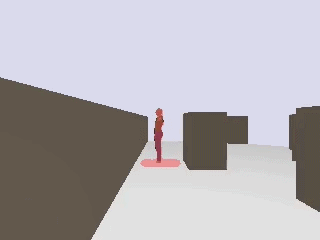

# Follow Everything：基於 SAM2 / AOT 的機器人領航員追蹤系統

本專案實作了一套完整的「機器人跟隨人員」研究堆疊（leader-following research stack），從**純 Python 的離線影片追蹤器**、到**2D 行為樹模擬**、再到**3D Gazebo Fortress 真實感知模擬**，三個階段層層疊加，可用於演算法研究、行為樹開發，以及真實機器人部署前的端到端驗證。

最新工作（2026-05）將 AOT/DeAOT 追蹤器引入 3D 模擬，並透過 CUDA 記憶體碎片化（fragmentation）的工程處理，將原本會 OOM 的 1001 幀長影片穩定壓在 5.8 GB VRAM 內。

---

## 三層架構總覽

| 層級 | 子目錄 | 用途 | 追蹤器 |
|---|---|---|---|
| 1. 離線影片追蹤器 | `follow_everything/` + `run_video.py` | 把研究論文中的 *Distance Frame Buffer* 機制做出可重現實作；離線跑 .mp4 並產出可視化影片 | **SAM2** (Meta) |
| 2. 2D Nav2 模擬 | [`follow_everything_nav2/`](follow_everything_nav2/) | 把追蹤器接到 py_trees 行為樹 + Nav2 風格的恢復行為（Following / Chasing / Recovery），用 2D 物理模擬訓練/測試追蹤策略 | Oracle camera（直接讀模擬內 leader 位置作為「完美感知」） |
| 3. 3D Gazebo 模擬 | [`follow_everything_nav2_3d/`](follow_everything_nav2_3d/) | 在 Gazebo Fortress 上實作 RGB-D + lidar + ROS 2 Humble；把 2D 的 BT 接到真實感知後端 | **EdgeTAM** (SAM2 衍生) 或 **AOT / DeAOT-L**（streaming VOS） |

每一層都保持各自的 `README.md` 與獨立可執行入口；下面整理本次工作流程中三層的最新狀態與如何啟動。

---

## 第一層：離線 SAM2 影片追蹤器（`run_video.py`）

實作論文 [Follow Everything (arXiv:2504.19399)](https://arxiv.org/html/2504.19399v1) 中的 **Distance Frame Buffer (DFB)** 機制：以深度資訊將 SAM2 的高信度分割特徵分桶（distance bucket）儲存，當領航員因遮擋或快速移動而消失時，從緩衝區中選擇與當前深度最接近的歷史特徵重新初始化 SAM2，大幅提升長影片中的重識別穩定度。

### 核心功能
* **SAM2 影像追蹤**：使用 `sam2.1_hiera_tiny.pt` 平衡速度與精度。
* **自動化目標識別**：YOLO11 + HSV 色彩過濾器自動挑選領航員（例如紅衣／黑衣）。
* **DFB 重識別**：論文中 §3.2 的距離分桶 + 信度過濾。
* **離線 / 線上雙模式**：離線可做多輪 Re-propagation；線上單向追蹤可上線部署。

### 快速開始

```bash
pip install -r requirements.txt
pip install -e .                                # SAM2

# H.264 轉檔（若原檔為 AV1 等格式）
ffmpeg -i input.mp4 -c:v libx264 -pix_fmt yuv420p output.mp4

# 自動選取畫面中心人物，處理 300 幀
python run_video.py --video output.mp4 --target-color any --num-frames 300

# 追蹤紅衣領航員、即時模式（不回溯）
python run_video.py --video data/test.mp4 --target-color red --no-reprompt

# 跳幀加速（2× 吞吐量，適合對延遲容忍度高的場景）
python run_video.py --video data/test.mp4 --frame-stride 2
```

主要參數：`--video / --output / --num-frames / --target-color / --no-reprompt / --max-reprompts / --frame-stride / --show / --out-video`，完整說明見 `python run_video.py --help`。

效能調校：`configs/follow_everything.yaml` 中啟用 `sam2.vos_optimized: true` 會以 `torch.compile(mode="max-autotune")` 編譯 memory attention / mask decoder（首次執行約 1–3 分鐘，之後快取於 `~/.cache/torch_extensions`）。

---

## 第二層：2D 行為樹模擬（`follow_everything_nav2/`）

模擬一台僅靠車載感測器（lidar、相機偵測、自身里程計）的差速驅動跟隨機器人，**全程沒有任何 ground-truth 地圖或領航員位姿**——所有避障與追蹤路徑必須由機器人自己從 lidar 學到的 log-odds 佔據網格規劃出來。

### 重點

* **地圖**：`empty / corridor / cluttered / forest`，可組態化的 Brownian 行人擾動。
* **行為樹（py_trees）**：Retreating / Following / Chasing / PlannedRec / BackupRec / SpiralExpand。
* **避作弊規則**：follower 從不訂閱 `/leader/*`，地圖必須現場學起來。
* **離線評估**：8 episodes × 多地圖一鍵跑完。

完整啟動方式（含 Docker、X11 forwarding、評估管線）請參考 [`follow_everything_nav2/README.md`](follow_everything_nav2/README.md)。

---

## 第三層：3D Gazebo Fortress + ROS 2 Humble（`follow_everything_nav2_3d/`）

把第二層的行為樹直接搬到 Gazebo Fortress 上，但把「oracle 完美感知」換成**真正的 RGB-D 相機 + 視覺追蹤器**。Topic contract（`/follower/odom`、`/follower/scan`、`/follower/camera/detections`、`/follower/cmd_vel`）與第二層完全相同，所以可以直接重用 2D 專案的 BT 程式碼。

### 已完成的階段（Phase 1 → Post-Phase 5）

| Phase | 內容 |
|---|---|
| 1 | 空場景、差速驅動 follower、teleop。 |
| 2 | 360° lidar 發佈 `/follower/scan`。 |
| 3 | 行走的人形 actor 領航員 + oracle 相機橋接器。 |
| 4a | RGB-D 相機 + DAM4SAM 追蹤器骨架。 |
| 4b-i | Docker 內 CUDA torch + DAM4SAM/SAM2/YOLO 依賴。 |
| 4b-ii | 真實 `SAM2Tracker` 接入：YOLO bootstrap + frame-by-frame mask + 深度反投影。 |
| 5 | 真實追蹤器成為主要偵測來源；簡易 P-controller follower。 |
| Post-Phase 5 | **DAM4SAM → EdgeTAM** 換掉以拿到 ~20 Hz（原本 ~3 Hz）。 |
| **本次更新** | **AOT/DeAOT-L 整合**（見下節）。 |

### 本次更新：AOT/DeAOT-L 整合

新增 [`follower_pkg/python/aot_tracker.py`](follow_everything_nav2_3d/follower_pkg/python/aot_tracker.py)：把 [yoxu515/aot-benchmark](https://github.com/yoxu515/aot-benchmark) 的 streaming VOS 引擎接到 follow_everything 的 topic contract。重點工程取捨：

1. **CUDA 相關性 (correlation) 核心**：AOT 的 matching attention 預設靠 `spatial_correlation_sampler`（CUDA C++ extension）。沒裝時走 pure-PyTorch fallback，效能差 3–5×。本次把它跑起來：

   * **主機端掛載 CUDA**：把主機 `/usr/local/cuda-13.0` 用 read-only volume 掛進容器（[`docker-compose.yml`](follow_everything_nav2_3d/docker-compose.yml)），不在映像檔內 apt-install CUDA toolkit（500 MB 下載 + NVIDIA CDN DNS 飄移問題）。
   * **執行階段安裝核心**：容器跑起來後在內部執行一次 `pip install spatial-correlation-sampler`，再 `docker commit` 烘進映像檔。詳細指令見 [`follow_everything_nav2_3d/README.md`](follow_everything_nav2_3d/README.md) 的「AOT requires a one-time setup inside the container」注意事項。

2. **長影片記憶體穩定度**：1001 幀測試影片在原始 `TEST_LONG_TERM_MEM_GAP=5` 設定下，於第 356 幀左右 OOM。實測發現**不是 VRAM 真的不夠，是 CUDA allocator 的記憶體碎片化**。修法：

   * `PYTORCH_CUDA_ALLOC_CONF=max_split_size_mb:128,garbage_collection_threshold:0.7,expandable_segments:True`。
   * `AOT_LT_MAX=80`（hard cap）+ **批次驅逐**（`AOT_LT_BATCH_EVICT_EVERY=50` 幀，保留最新 `AOT_LT_KEEP_RATIO=0.8` 比例），比逐幀切片對 allocator 友善很多。
   * 每 200 幀 `gc.collect()` + `torch.cuda.empty_cache()`。
   * 結果：5.8 GB alloc 穩定不動，從第 4.2% 碎片率「降到」第 2.1%（碎片率隨 batch eviction 反而越收越緊）。

3. **AOT eval 入口**：

   ```bash
   # 在跑起來的 sim 容器內，從 /ws：
   TRACKER_KIND=aot python3 eval/record_episode.py 60 edgetam forest
   ```

   支援 `AOT_MODEL`、`AOT_CKPT`、`AOT_LT_GAP`、`AOT_LT_MAX`、`AOT_LT_BATCH_EVICT_EVERY`、`AOT_LT_KEEP_RATIO`、`AOT_DEBUG_FRAMES` 等環境變數覆蓋；詳見 3D 子目錄 README 的環境變數表。

### 啟動 3D 模擬

```bash
# 1) 編譯 image（host CUDA 已掛載，編譯快很多）
cd follow_everything_nav2_3d
docker compose build

# 2) 啟動容器並裝 CUDA correlation kernel（一次性）
docker compose up -d sim
docker exec follow_everything_nav2_3d \
    pip install --no-cache-dir --no-build-isolation spatial-correlation-sampler
docker commit follow_everything_nav2_3d follow_everything_nav2_3d:latest

# 3) 跑 60 秒 forest 評估，AOT 為追蹤器
docker exec -it follow_everything_nav2_3d bash -lc \
   'source /opt/ros/humble/setup.bash && cd /ws && \
    TRACKER_KIND=aot python3 eval/record_episode.py 60 edgetam forest'
```

完整安裝、X11 forwarding、phase-by-phase 啟動順序見 [`follow_everything_nav2_3d/README.md`](follow_everything_nav2_3d/README.md)。

---

## 工程經驗紀錄（Lessons learned）

* **「長 inference 迴圈裡的 CUDA OOM 八成是碎片化、不是 VRAM 滿。」** 先 `print(memory_allocated / memory_reserved)`；如果碎片率高（>20%），加 `expandable_segments:True` + 批次驅逐通常就解決，不需要動模型。
* **不要在 image 內裝 CUDA toolkit（特別是 sbsa aarch64 平台）**：~500 MB + 對 NVIDIA CDN DNS 敏感。改用主機掛載 `/usr/local/cuda-XX.X` + 容器內一次性 `pip install` + `docker commit`。
* **Gazebo Fortress 的 `<actor>` 不接受 `<link><collision>`** — 是 SDF 規範陷阱（未明確記錄）。若要 leader 帶 walk animation，要用 actor + scripted trajectory，但會失去 collision，跟 lidar 串接要另想辦法。

---

## 引用 (Reference)

```bibtex
@article{wang2025follow,
  title={Follow Everything: A Leader-Following and Obstacle Avoidance Framework with Goal-Aware Adaptation},
  author={Wang, Youran and others},
  journal={arXiv preprint arXiv:2504.19399},
  year={2025}
}
```

更多詳細的技術對照表與實驗結果請參閱 [`analysis_paper.md`](analysis_paper.md)。

---

## 展示

3D Gazebo forest 場景下，AOT 追蹤器持續追蹤領航員 60 秒（real-time 1× 播放，正面相機視角，紅色為 AOT 預測之 mask）：


